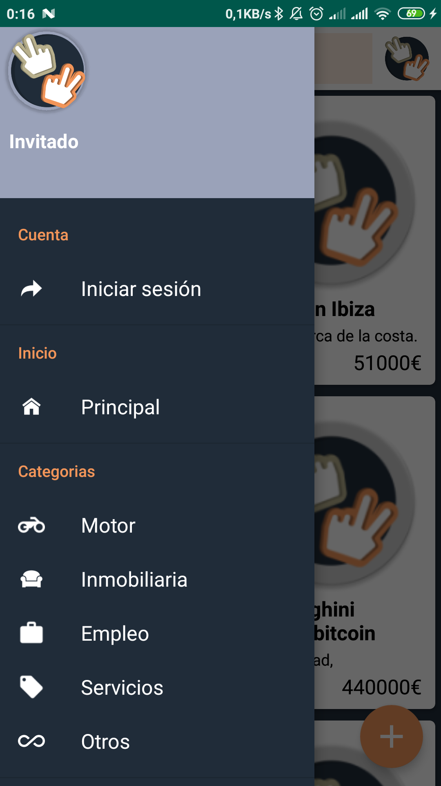
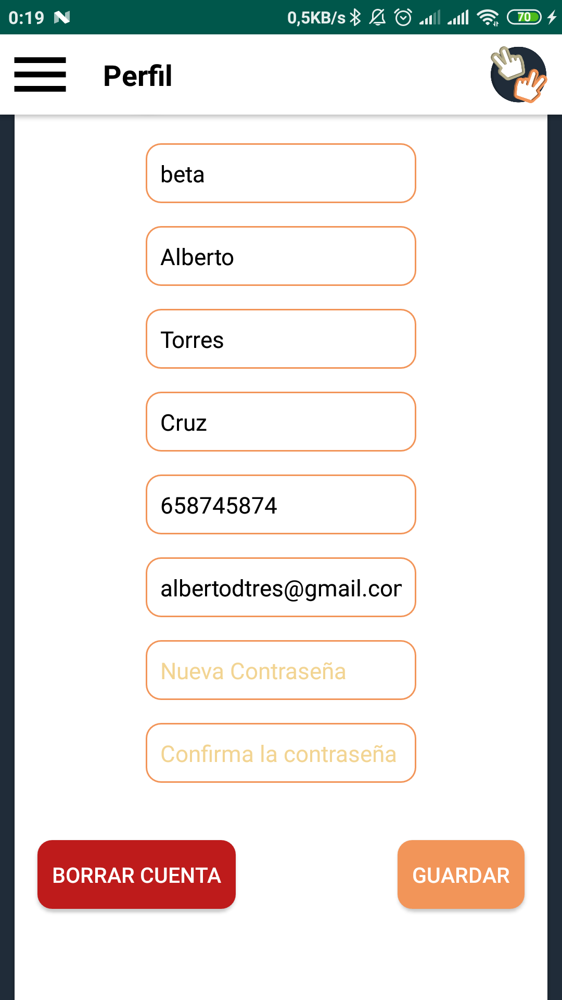
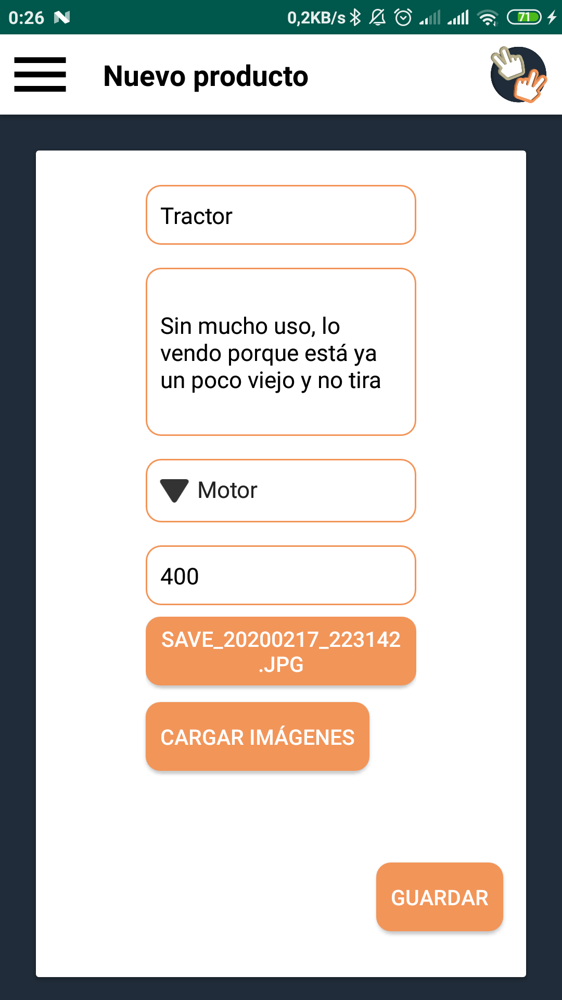
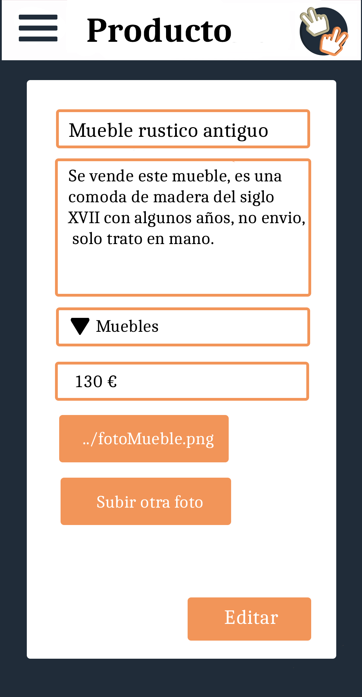
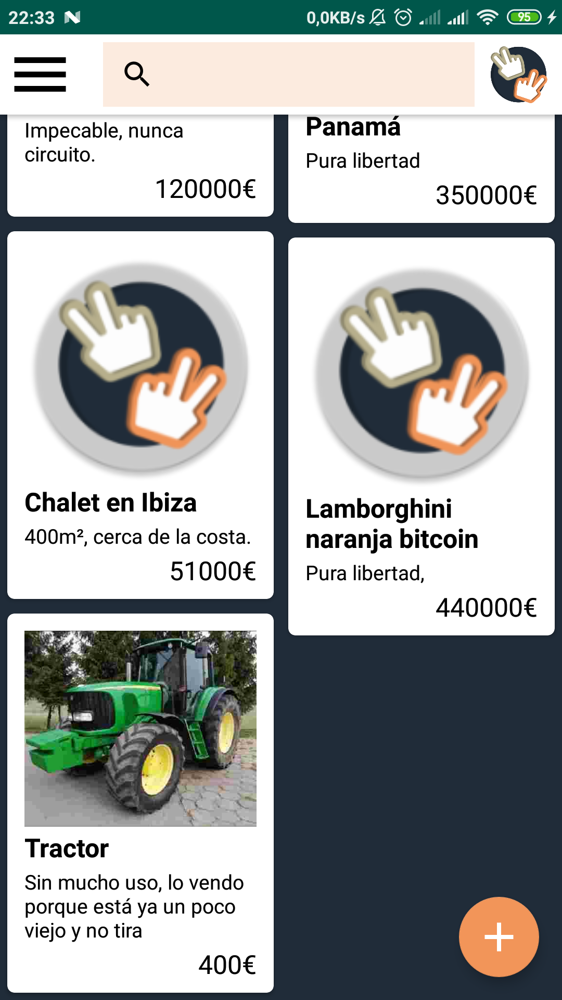

# Proyecto SecondLife 2020


---

[Requisitos](docs/requisitos.md) -
[Resumen](docs/resumen.md) - 
[Endpoints](docs/endpoints.md) 

---
  
# ¿Cómo funciona SecondLife?:

## Splash Screen
Nada más acceder a la aplicación podemos ver un bonito splash screen que aparecerá apenas unos segundos con el logotipo creado por nosotros para nuestro proyecto.

<table align="center">
    <tr>
        <td align="right">
            
            <p>Idea incial con photoshop</p>
        </td>
        <td>
            
            <p>Resultado final</p>
        </td>
    </tr>
<table>


## Pantalla principal
Una vez visto el splash screen podremos ver la pantalla de inicio de sesión junto con la opción de registrarse. Esta pantalla es totalmente opcional ya que hemos considerado que podemos tener un usuario "Invitado" sin una cuenta aún, por lo que podemos cerrar esta ventana si deseamos en la esquina superior derecha.

<table align="center">
    <tr>
        <td align="right">
            
            <p>Idea incial con photoshop</p>
        </td>
        <td>
            
            <p>Resultado final</p>
        </td>
    </tr>
<table>


## Registro
En caso de que deseemos una nueva cuenta, solo tendremos que pulsar en "Registrarme" y nos saldrá la siguiente pantalla donde nos pedirá los datos iniciales. Todos no son necesarios, en este caso el teléfono y el segundo apellido es opcional.

<p align="center">
    
</p>

## Usuario invitado
Como comentábamos antes, podemos acceder sin tener ningún usuario, en este caso en el "Navigation drawer" del que dispone la aplicación, podremos ver un acceso directo a "Iniciar sesión" por si nos lo hemos pensado mejor, una foto genérica en la cabecera, y de nombre simplemente "Invitado". También podemos acceder a las categorías de los anuncios sin necesidad de cuenta.

<p align="center">
    
</p>

## Usuario registrado
En caso de que tengamos una cuenta iniciada sesión, nos saldrá en el "Navigation drawer" una sección de "Cuenta". En ella dispondremos de un acceso directo a nuestro perfil, donde podremos editar los datos personales y la imagen de la cuenta en la que hemos iniciado. También dispondremos de un "Engranaje" en la parte derecha del nombre de usuario para acceder al mismo menú que pulsando "Mi perfil". Además tenemos un botón "Cerrar sesión, el cual nos permitirá acceder como otro usuario diferente o simplemente quedarnos como "Invitado". Por otra parte, en la cabecera ya si disponemos de nuestros datos personales como nombre, apellidos, email y foto de perfil.

<table align="center">
    <tr>
        <td align="right">
            
            <p>Idea incial con photoshop</p>
        </td>
        <td>
            
            <p>Resultado final</p>
        </td>
    </tr>
<table>

## Perfil de usuario
Si accedemos mediante el acceso directo de "Perfil" nos saldrá la siguiente pantalla, en la cual podremos modificar todos los datos, incluso modificar la contraseña actual de la cuenta. En caso de que no queramos modificar la contraseña, la podemos dejar en blanco, y seguir cambiando algun campo en concreto que deseemos modificar. Si nos fijamos el campo de búsqueda del toolbar ha cambiado y ahora hay un texto que pone "Perfil". También disponemos de un botón que podemos reconocer como "Subir imagen", en el cual seleccionaremos un archivo de la galería de nuestro dispositivo y nos cambiará la imagen del perfil.

<table align="center">
    <tr>
        <td align="right">
            
            <p>Idea incial con photoshop</p>
        </td>
        <td>
            
            <p>Resultado final</p>
        </td>
    </tr>
<table>

## Perfil de usuario II
Seguimos en la misma pantalla, pero esta vez la hemos bajado un poco, ya que dispone de un scrollview para que se adapte a la mayoría de dispositivos. Al final de esta ventana podemos observar 2 botones. Uno de ellos "Guardar" para que se hagan efectivos los cambios anteriores en nuestros datos personales, y otro "Borrar cuenta", para estar al tanto de la ley de protección de datos. Un usuario puede solicitar mediante este botón que se borren sus datos de inmediato. Posteriormente se cerrará la sesión y se quedará como "Invitado".

<table align="center">
    <tr>
        <td align="right">
            
            <p>Idea incial con photoshop</p>
        </td>
        <td>
            
            <p>Resultado final</p>
        </td>
    </tr>
<table>

## Productos y categorias 
Una vez tenemos usuarios nos falta algo con que interactuar, en este caso con productos y categorías. Como hemos visto en el "Navigation Drawer", en el que podemos acceder en el botón superior izquierdo, tenemos varias categorías de productos. Si queremos podemos filtrarlos por nombre y descripción en la barra de búsqueda que se sitúa en la parte superior. Además podemos observar como tenemos un botón "FAB" en la parte inferior derecha para añadir nuestros propios productos.

<table align="center">
    <tr>
        <td align="right">
            
            <p>Idea incial con photoshop</p>
        </td>
        <td align="center">
            
            <p>Resultado final</p>
        </td>
        <td>
            
            <p>Resultado final</p>
        </td>
    </tr>
<table>


## Nuevos productos 
En la lista de productos nos hemos dado cuenta que tenemos un botón como hemos comentado en el anterior punto, que nos permitirá añadir nuevos productos. Como podemos ver en la siguiente imagen, ya tenemos rellenos los datos del nuevo producto, que seria el titulo, descripción, categoría, precio y una lista de imágenes. Automáticamente este producto se vincula a la cuenta en la que hemos iniciado sesión. Además si nos fijamos de nuevo en el toolbar ha cambiado por el titulo "Nuevo producto". Por último comentar que podemos añadir varias imágenes y la página se va redimensionando automáticamente (esto lo veremos posteriormente).

<table align="center">
    <tr>
        <td align="right">
            
            <p>Idea incial con photoshop</p>
        </td>
        <td>
            
            <p>Resultado final</p>
        </td>
    </tr>
<table>


## Mis productos
Anteriormente no hemos podido ver el detalle de "Mis anuncios" que tiene el "Navigation drawer" justo abajo. Podemos entrar en esta pantalla para ver nuestros anuncios publicados.

<p align="center">
    
</p>

## Detalle de producto
Al pulsar sobre cualquier producto podremos ver el detalle de este, con fotos, titulo, descripción e incluso un contador de visitas. Obviamente solo podremos editarlo si lo hemos publicado, mediante el botón inferior "Editar" que veremos a continuación.

<p align="center">
    
</p>

## Editar un producto
Seguramente queramos actualizar algún dato del producto que hemos publicado, por lo que tenemos la vista de editar, en la que como podemos ver y anteriormente hemos comentado, se pueden añadir múltiples imágenes.

<table align="center">
    <tr>
        <td align="right">
            
            <p>Idea incial con photoshop</p>
        </td>
        <td>
            
            <p>Resultado final</p>
        </td>
    </tr>
<table>

## Lista productos
Ya podemos ver nuestro anuncio publicado, esperando al comprador correcto, dentro de la lista de anuncios.
<p align="center">
    
</p>

# Servidor de SecondLife
## El servidor está formado por 4 contenedores docker:
- Base de datos mongo (10.107.0.20)
- Cliente gráfico para mongo, llamado mongo express (10.107.0.21)
- Un cliente de mongo para importar la base de datos
- Contenedor de node (10.107.0.22)

## Comandos docker
### Generar los contenedores:
```bash
docker-compose up
```

### Iniciar / Parar:
```bash
docker-compose start
docker-compose stop
```

### Borrar:
```bash
docker-compose down
```

### Generar de nuevo los contenedores con los nuevos cambios:
```bash
docker-compose build
```

#### Limpiar cache:
Si realizamos ajustes en la configuración de docker-compose y no se aplican deberemos limpiar el cache con el siguiente comando.
```bash
docker system prune -a
```

## Tipos de usuarios:
### El tipo de usuario, solo se puede de momento manualmente en la base de datos, para en un futuro implementar un sistema de permisos.
- Tipo 1: Usuario estandar
- Tipo 2: Usuario administrador

# Documentación

## Esquema de la base de datos:


## Diagrama de clases :


## Participantes:

- Alberto Torres Cruz
- Álvaro García Muñoz 
